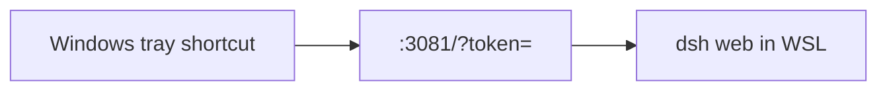

# dsh-wsl-tray

> **Install set:** part of [dsh-wsl-kit](https://github.com/173787247/dsh-wsl-kit). Prefer `KIT_SET=llm` | `full`. Fault tree: [TROUBLESHOOTING.md](https://github.com/173787247/dsh-wsl-kit/blob/master/docs/TROUBLESHOOTING.md).

DeepSeek Harness plugin: install or report a **Windows tray / shortcut** launcher for `dsh web` running in WSL (start, restart, health).

Part of **[dsh-wsl-kit](https://github.com/173787247/dsh-wsl-kit)**.

[中文说明 → README.zh.md](./README.zh.md)

## Where it sits

Installs or reports a Windows tray shortcut that opens the dsh web UI.



Suite diagram and version snapshot: [dsh-wsl-kit](https://github.com/173787247/dsh-wsl-kit#how-the-pieces-fit). This plugin is **0.2.4** (full; also in llm). Do not copy that matrix into this README.


## Compatibility

| Field | Value |
|-------|-------|
| **Plugin** | `dsh-wsl-tray` **0.2.4** |
| **Minimum dsh** | ≥ **0.1.2** (web UI one-shot `?token=` on Windows relay `:3081`) |
| **Latest verified** | See [dsh-wsl-kit Compatibility](https://github.com/173787247/dsh-wsl-kit#compatibility-2026-09) (currently **`0.1.5-rc.1`**) — single source of truth for the suite |
| **Kit set** | `llm` / `full` (some also useful alone) |
| **Cloud Flash** | Use model id **`deepseek-flash`** (V4.1 Flash) in `~/.dsh/settings.yaml` / `llm-deepseek` — not configured by this plugin |
| **Agent Teams** | Upstream experimental; not required here |

Suite floor versions: kit [`check-plugin-versions.sh`](https://github.com/173787247/dsh-wsl-kit/blob/master/scripts/check-plugin-versions.sh). Fault tree: [TROUBLESHOOTING.md](https://github.com/173787247/dsh-wsl-kit/blob/master/docs/TROUBLESHOOTING.md).

**Scope:** Windows tray/shortcut around kit start/restart/health. Open the URL with `?token=` from restart output or `/tmp/dsh-ui-url` (dsh ≥0.1.2).

## Why

Clicking a tray icon is easier than remembering WSL + `restart-dsh-web.sh`. The hard part after dsh **0.1.2** is the **one-shot launch token**: bare `http://127.0.0.1:3081/` returns **401**. Tray actions should open the token URL (or re-run restart so a fresh token is printed).

## Install

```sh
dsh plugin --profile web add github:173787247/dsh-wsl-tray
# or local:
dsh plugin --profile web add /absolute/path/to/dsh-wsl-tray
```

Restart `dsh web` and open a **new** session. Tool: `wsl_tray`.

Set `DSH_WSL_KIT` to your kit checkout (or pass `kitPath`). Tray menu includes **Start / Restart** and **Health check** ([`scripts/check-dsh-health.sh`](https://github.com/173787247/dsh-wsl-kit/blob/master/scripts/check-dsh-health.sh)).

## Usage notes

- Prefer kit [`restart-dsh-web.sh`](https://github.com/173787247/dsh-wsl-kit/blob/master/scripts/restart-dsh-web.sh) so proxy env + relay stay correct.
- After restart, open the printed `ui=` URL (also in WSL `/tmp/dsh-ui-url`). Do not bookmark bare `:3081`.
- Token is **one-shot per process** — restarting dsh invalidates the previous token.

## License

MIT
